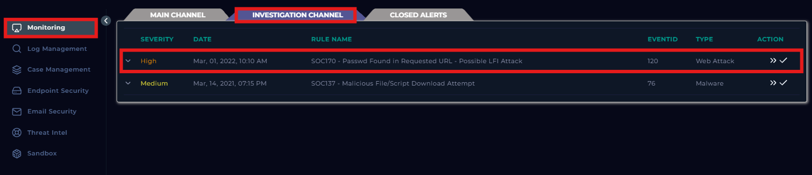
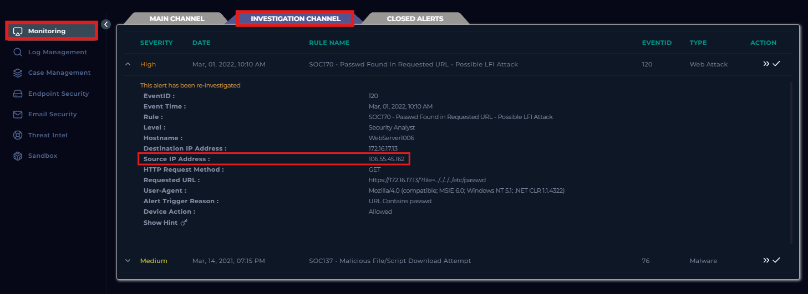
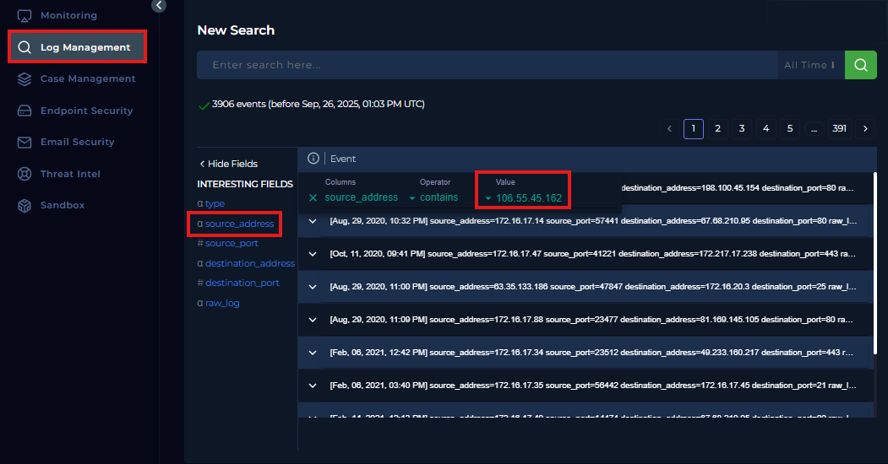
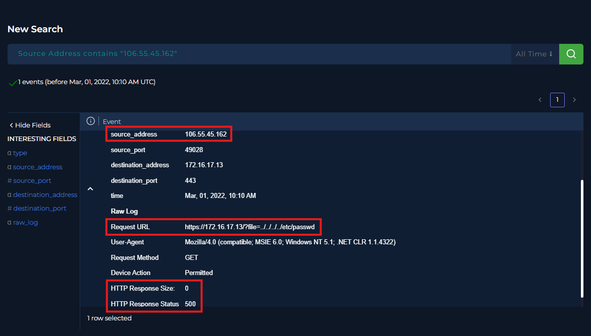
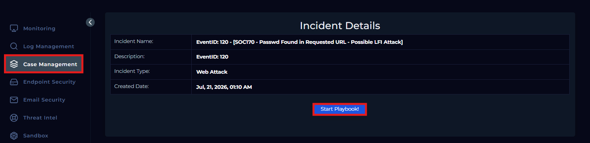

# LetsDefend Walkthrough: SOC170 - Passwd Found in Requested URL

## Alert Summary

| Field | Value |
| :--- | :--- |
| **Severity:** | High |
| **Date:** | March 1, 2022 |
| **Alert:** | SOC170 - Passwd Found in Requested URL - Possible LFI Attack |
| **Event ID:** | 120 |
| **Event Time:** | Mar, 01, 2022, 10:10 AM |
| **Level:** | Security Analyst |
| **Hostname:** | `WebServer1006` |
| **Destination IP Address:** | `172.16.17.13` |
| **Source IP Address:** | `106.55.45.162` |
| **HTTP Request Method:** | `GET` |
| **Requested URL:** | `https://172.16.17.13/?file=../../../../etc/passwd` |
| **User-Agent:** | Mozilla/4.0 (compatible; MSIE 6.0; Windows NT 5.1; .NET CLR 1.1.4322) |
| **Alert Trigger Reason:** | URL Contains `passwd` |
| **Device Action:** | Permitted |
| **HTTP Response Size:** | `0` bytes |

---

# Step-by-Step Investigation

## Step 1 - Open the Investigation Channel

From the LetsDefend dashboard:

1. Open **Monitoring**
2. Select **Investigation Channel**
3. Locate the alert:

```text
SOC170 — Passwd Found in Requested URL — Possible LFI Attack
```



4. Open the alert and review the event details.

Important fields to record, especially the source IP, the requested URL, and the alert trigger reason:

- Source IP Address: `106.55.45.162`
- Requested URL: `https://172.16.17.13/?file=../../../../etc/passwd`
- Alert Trigger Reason: URL Contains `passwd`
  


## Step 2 - Search the Logs
1. Open **Log Management**
2. Select the **source_address** field
3. Filter the logs entring source IP address **(106.55.45.162)** under **Value** 

The search returned one event associated with the source IP.



## Step 3 - Analyze the Request and Response
Expand the matching log event and review the raw request details.

The requested URL:

```text
https://172.16.17.13/?file=../../../../etc/passwd
```

The server response:

```text
HTTP Response Status: 500
HTTP Response Size: 0 bytes
```
The server returned a **500 Internal Server Error** with **no response data**. Together, these findings indicate that the requested file was not returned and the attack attempt was **unsuccessful**.



---

## Initial Analysis

The requested URL contained:

```text
../../../../etc/passwd
```

The repeated `../` sequences were used to move upward through the server's directory structure. 

The target file, `/etc/passwd`, is a sensitive Linux system file containing local user account information.

This activity is consistent with a directory traversal and Local File Inclusion attempt.

---

## Case Management

Open **Case Management**, locate Event ID `120`, and select **Start Playbook**.



### 1. Is Traffic Malicious?

**Answer: Malicious**

The request attempted to access `/etc/passwd` using repeated directory traversal.

### 2. What Is The Attack Type?

**Answer: LFI (Local File Inclusion)**

The attacker manipulated the file parameter to request a local system file outside the application's intended directory.

### 3. Is it a planned test?
**Answer: Not Planned**

There are no indicators that the activity was part of an authorized internal simulation or penetration test.

### 4. What Is The Direction of Traffic?
**Answer: Internet → Company Network**

The request originated from an external IP address and targeted an internal web server.

### 5. Was the attack successful?
**Answer: No**

The server returned HTTP status 500 with a response size of 0 bytes. No contents from /etc/passwd were returned.

### 6. Add Artifacts

| Value | Comment | Type |
| :--- | :--- | :--- |
| `106.55.45.162` | Source IP that sent the LFI request | IP Address |
| `https://172.16.17.13/?file=../../../../etc/passwd` | Requested URL containing the directory traversal payload | URL Address |


### 7. Do you need Tier 2 Escalation?
**Answer: No**

No evidence of successful file disclosure, persistence, or broader compromise was identified within the scope of the investigation.

### Analyst Note

This alert was a true positive. The external source IP 106.55.45.162 attempted a Local File Inclusion (LFI) attack using directory traversal to access /etc/passwd. Log analysis showed an HTTP 500 internal server error with a response size of 0 bytes. Based on the available evidence, the requested file was not returned and the attack was unsuccessful.

### Close Alert

**Event ID:** `120`

**Note:**
True positive. I filtered the logs by the source IP and reviewed the related request. The server returned HTTP 500 with a response size of 0 bytes, indicating that the LFI attempt was unsuccessful. No containment or Tier 2 escalation was required.

